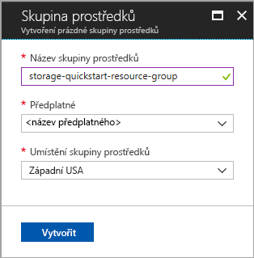
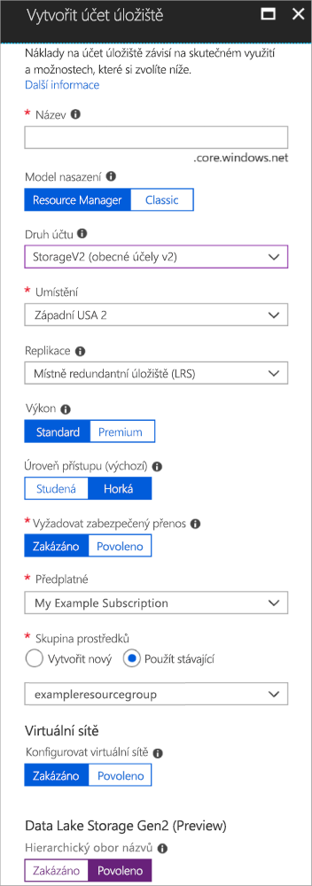

# <a name="quickstart-create-an-azure-data-lake-storage-gen2-preview-storage-account"></a>Rychlý start: Vytvoření účtu úložiště Azure Data Lake Storage Gen2 Preview

Účty Azure Data Lake Storage Gen2 Preview [podporují službu Hierarchical Namespace Service](introduction.md), která nabízí nativní adresářový systém souborů přizpůsobený pro práci se systémem souborů HDFS (Hadoop Distributed File System). Přístup k datům v Data Lake Storage Gen2 je z HDFS možný prostřednictvím [ovladače ABFS](abfs-driver.md).

Pokud chcete v účtu úložiště povolit možnosti Data Lake Storage Gen2, [vyplňte průzkum k verzi Preview s žádostí o přístup](https://aka.ms/adlsgen2signup). Po schválení budete moci vytvořit nový účet Data Lake Storage Gen2. V tomto rychlém startu si ukážeme, jak vytvořit účet pomocí [webu Azure Portal](https://portal.azure.com/), [Azure PowerShellu](https://docs.microsoft.com/powershell/azure/overview) nebo prostřednictvím [Azure CLI](https://docs.microsoft.com/cli/azure?view=azure-cli-latest).

> [!NOTE]
> Uživatelské rozhraní pro vytvoření účtu na webu Azure Portal se aktualizuje, jakmile budete mít schváleno vytvoření účtu Data Lake Storage Gen2. To samé platí i o argumentech PowerShellu a CLI týkajících se Data Lake Storage Gen2, které fungují, až po schválení verze Preview.

## <a name="prerequisites"></a>Požadavky

Pokud ještě nemáte předplatné Azure, vytvořte si [bezplatný účet](https://azure.microsoft.com/free/) před tím, než začnete.

|           | Požadavek |
|-----------|--------------|
|Portál     | Žádný         |
|PowerShell | Pro tento rychlý start potřebujete modul Azure PowerShell **5.0.4 – Preview** nebo novější. Aktuální verzi zjistíte spuštěním `Get-Module -ListAvailable AzureRM`. Pokud potřebujete instalaci nebo upgrade, přečtěte si téma [Instalace modulu Azure PowerShell](/powershell/azure/install-azurerm-ps). |
|Rozhraní příkazového řádku        | Pokud se chcete přihlásit do Azure s spouštět příkazy rozhraní příkazového řádku Azure CLI, máte dvě možnosti: <ul><li>Příkazy rozhraní příkazového řádku můžete spouštět v prostředí Azure Portal, v Azure Cloud Shellu. </li><li>Můžete nainstalovat rozhraní příkazového řádku a příkazy rozhraní příkazového řádku spouštět místně.</li></ul>|

Při práci s příkazovým řádkem můžete spustit prostředí Azure Cloud nebo nainstalovat CLI lokálně.

### <a name="use-azure-cloud-shell"></a>Použití Azure Cloud Shellu

Azure Cloud Shell je volně dostupné prostředí Bash, které můžete spustit přímo z webu Azure Portal. Má předinstalované rozhraní Azure CLI, které je nakonfigurované pro použití s vaším účtem. Klikněte na tlačítko **Cloud Shell** v nabídce v pravé horní části webu Azure Portal:

[](https://portal.azure.com)

Toto tlačítko spustí interaktivní prostředí, které můžete použít k provedení kroků v tomto rychlém startu:

[](https://portal.azure.com)

### <a name="install-the-cli-locally"></a>Místní instalace rozhraní příkazového řádku

Rozhraní příkazového řádku Azure můžete také nainstalovat a používat místně. Tento rychlý start vyžaduje použití Azure CLI verze 2.0.4 nebo novější. Verzi zjistíte spuštěním příkazu `az --version`. Pokud potřebujete instalaci nebo upgrade, přečtěte si téma [Instalace Azure CLI 2.0](/cli/azure/install-azure-cli).

## <a name="overview-of-creating-an-azure-data-lake-storage-gen2-account"></a>Přehled vytvoření účtu Azure Data Lake Storage Gen2

Než vytvoříte účet, musíte napřed vytvořit skupinu prostředků, která funguje jako logický kontejner účtů úložiště nebo jiných vámi vytvořených prostředků Azure. Pokud chcete vyčistit prostředky vytvořené v tomto rychlém startu, stačí jednoduše odstranit skupinu prostředků. Odstraněním skupiny prostředků odstraníte také přidružený účet úložiště a všechny další prostředky, které jsou k příslušné skupině prostředků přidružené. Další informace o skupinách prostředků najdete v [přehledu Azure Resource Manageru](../../azure-resource-manager/resource-group-overview.md).

> [!NOTE]
> Abyste mohli využít funkce Data Lake Storage Gen2, musí být nově vytvořené účty úložiště typu **StorageV2 (obecná verze 2)**.  

Další informace o typech účtů úložiště najdete v článku [Možnosti účtu Azure Storage](../common/storage-account-options.md).

Při pojmenování účtu úložiště mějte na paměti tato pravidla:

- Názvy účtů úložiště musí mít od 3 do 24 znaků a můžou obsahovat jenom číslice a malá písmena.
- Váš název účtu úložiště musí být jedinečný v rámci Azure. Žádné dva účty úložiště nemohou mít stejný název.

## <a name="create-an-account-using-the-azure-portal"></a>Vytvoření účtu na webu Azure Portal

Přihlaste se k portálu [Azure Portal](https://portal.azure.com).

### <a name="create-a-resource-group"></a>Vytvoření skupiny prostředků

Při vytváření skupiny prostředků na webu Azure Portal použijte tento postup:

1. Na webu Azure Portal rozbalením nabídky na levé straně otevřete nabídku služeb a zvolte **Skupiny prostředků**.
2. Kliknutím na tlačítko **Přidat** přidáte novou skupinu prostředků.
3. Zadejte název nové skupiny prostředků.
4. Vyberte předplatné, ve kterém chcete novou skupinu prostředků vytvořit.
5. Vyberte umístění pro tuto skupinu prostředků.
6. Klikněte na tlačítko **Vytvořit**.  



### <a name="create-a-general-purpose-v2-storage-account"></a>Vytvoření obecného účtu úložiště verze 2

Pokud chcete vytvořit účet úložiště pro obecné účely verze 2 na webu Azure Portal, postupujte takto:

> [!NOTE]
> Hierarchický obor názvů je povolený jenom v oblastech Západ USA 2 a Středozápad USA. Proto při vytváření účtu úložiště vyberte jedno z těchto umístění.

1. Na webu Azure Portal rozbalením nabídky na levé straně otevřete nabídku služeb a zvolte **Všechny služby**. Potom přejděte dolů do části **Úložiště** a zvolte **Účty úložiště**. V okně **Účty úložiště**, které se zobrazí, zvolte **Přidat**.
2. Zadejte název účtu úložiště.
3. V poli **Model nasazení** nechte nastavenou výchozí hodnotu.
4. V poli **Druh účtu** nastavte hodnotu **StorageV2 (v2 pro obecné účely)**.
5. Nastavte **Umístění** na **Západní USA 2**.
6. V poli **Replikace** nechte nastavenou hodnotu **Místně redundantní úložiště (LRS)**.
7. V polích **Replikace**, **Výkon** a **Úroveň přístupu** nechte výchozí hodnoty.
8. Vyberte předplatné, ve kterém chcete vytvořit účet úložiště.
9. V části **Skupina prostředků** vyberte **Použít stávající** a potom zvolte skupinu prostředků, kterou jste vytvořili v předchozí části.
10. Výchozí hodnotu nechte i v poli **Virtuální sítě**.
11. V oddílu **Data Lake Storage Gen2 (preview)** nastavte **Hierarchical namespace** (Hierarchický obor názvů) na **Enabled** (Povoleno).
12. Vytvořte účet úložiště kliknutím na **Vytvořit**.



Na portálu jste vytvořili účet úložiště.

### <a name="clean-up-resources"></a>Vyčištění prostředků

Pokud chcete odebrat skupinu prostředků s využitím webu Azure Portal:

1. Na webu Azure Portal rozbalením nabídky na levé straně otevřete nabídku služeb a zvolte **Skupiny prostředků**. Zobrazí se seznam skupin prostředků.
2. Vyhledejte skupinu prostředků, kterou chcete odstranit, a klikněte pravým tlačítkem myši na tlačítko **Další** (**...** ) na pravé straně seznamu.
3. Vyberte **Odstranit skupinu prostředků** a potvrďte tuto akci.

## <a name="create-an-account-using-powershell"></a>Vytvoření účtu pomocí PowerShellu

Přihlaste se k předplatnému Azure pomocí příkazu `Login-AzureRmAccount` a při ověřování postupujte podle pokynů na obrazovce.

```powershell
Login-AzureRmAccount
```

### <a name="create-a-resource-group"></a>Vytvoření skupiny prostředků

Pokud chcete vytvořit novou skupinu prostředků pomocí PowerShellu, použijte příkaz [New-AzureRmResourceGroup](/powershell/module/azurerm.resources/new-azurermresourcegroup): 

> [!NOTE]
> Hierarchický obor názvů je povolený jenom v oblastech Západ USA 2 a Středozápad USA. Proto při vytváření účtu úložiště vyberte jedno z těchto umístění.

```powershell
# put resource group in a variable so you can use the same group name going forward,
# without hardcoding it repeatedly
$resourceGroup = "storage-quickstart-resource-group"
$location = "westus2"
New-AzureRmResourceGroup -Name $resourceGroup -Location $location
```

### <a name="create-a-general-purpose-v2-storage-account"></a>Vytvoření obecného účtu úložiště verze 2

Pokud chcete vytvořit účet úložiště pro obecné účely verze 2 pomocí PowerShellu s využitím místně redundantního úložiště (LRS), použijte příkaz [New-AzureRmStorageAccount](/powershell/module/azurerm.storage/New-AzureRmStorageAccount):

```powershell
Get-AzureRmLocation | select Location 
$location = "westus2"

New-AzureRmStorageAccount -ResourceGroupName $resourceGroup `
  -Name "storagequickstart" `
  -Location $location `
  -SkuName Standard_LRS `
  -Kind StorageV2 
  -HierarchialNamespace $True
```

### <a name="clean-up-resources"></a>Vyčištění prostředků

Pokud chcete odebrat skupinu prostředků a její přidružené prostředky, včetně nového účtu úložiště, použijte příkaz [Remove-AzureRmResourceGroup](/powershell/module/azurerm.resources/remove-azurermresourcegroup): 

```powershell
Remove-AzureRmResourceGroup -Name $resourceGroup
```

## <a name="create-an-account-using-azure-cli"></a>Vytvoření účtu pomocí Azure CLI 

Pokud chcete spustit Azure Cloud Shell, přihlaste se k webu [Azure Portal](https://portal.azure.com).

Pro přihlášení k místní instalaci rozhraní příkazového řádku spusťte přihlašovací příkaz:

```cli
az login
```
### <a name="create-a-resource-group"></a>Vytvoření skupiny prostředků

Pokud chcete vytvořit novou skupinu prostředků pomocí rozhraní příkazového řádku Azure, použijte příkaz [az group create](/cli/azure/group#az_group_create). 

```azurecli-interactive
az group create \
    --name storage-quickstart-resource-group \
    --location westus2
```

> [!NOTE]
> Hierarchický obor názvů je povolený jenom v oblastech Západ USA 2 a Středozápad USA. Proto při vytváření účtu úložiště vyberte jedno z těchto umístění.

### <a name="create-a-general-purpose-v2-storage-account"></a>Vytvoření obecného účtu úložiště verze 2

Pokud chcete vytvořit účet úložiště pro obecné účely verze 2 s využitím rozhraní příkazového řádku Azure a místně redundantního úložiště, použijte příkaz [az storage account create](/cli/azure/storage/account#az_storage_account_create).

```azurecli-interactive
az storage account create \
    --name storagequickstart \
    --resource-group storage-quickstart-resource-group \
    --location westus2 \
    --sku Standard_LRS \
    --kind StorageV2 \
    --hierarchical-namespace true
```

### <a name="clean-up-resources"></a>Vyčištění prostředků

Pokud chcete odebrat skupinu prostředků a její přidružené prostředky, včetně nového účtu úložiště, použijte příkaz [az group delete](/cli/azure/group#az_group_delete).

```azurecli-interactive
az group delete --name myResourceGroup
```

## <a name="next-steps"></a>Další kroky

V tomto rychlém startu jste vytvořili účet úložiště Data Lake Storage Gen2. Pokud chcete zjistit, jak v účtu úložiště nahrávat a stahovat objekty blob, pokračujte k rychlému startu pro úložiště objektů blob.

* [Přesun dat do nebo ze služby Azure Blob Storage nástrojem AzCopy](https://docs.microsoft.com/en-us/azure/machine-learning/team-data-science-process/move-data-to-azure-blob-using-azcopy)