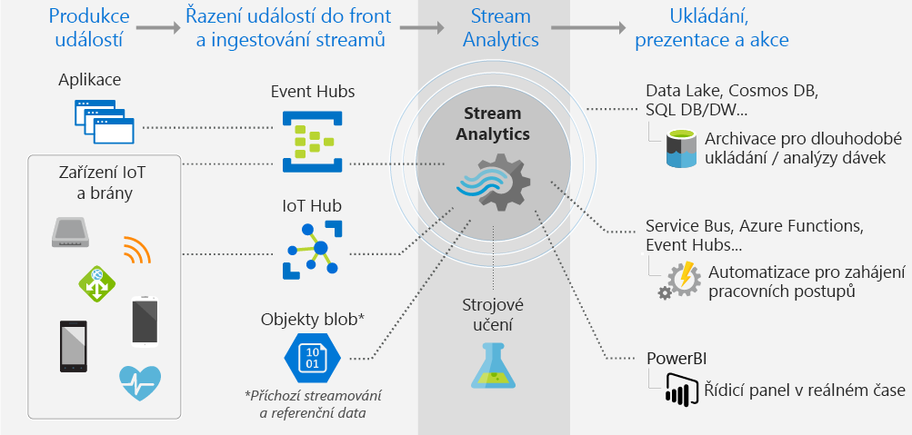

# Co je služba Stream Analytics?

Azure Stream Analytics je spravovaný modul pro zpracování událostí nastavený na provádění analytických výpočtů streamovaných dat v reálném čase. Data můžou pocházet ze zařízení, senzorů, webů, informačních kanálů sociálních médií, aplikací, systémů infrastruktury a dalších zdrojů. 

Pomocí Stream Analytics můžete zkoumat velké objemy dat streamovaných ze zařízení nebo procesů, extrahovat z tohoto datového proudu informace a identifikovat vzory, trendy a vztahy. S využitím těchto vzorů můžete aktivovat další procesy nebo akce, jako jsou upozornění, pracovní postupy automatizace, odesílání informací do nástrojů pro generování sestav, nebo je můžete uložit a prozkoumat později. 

Několik příkladů:

* Analýzy obchodování na burze a výstrahy.
* Odhalování podvodů, data a identifikace ochrany. 
* Vložené analýzy snímačů a ovladačů.
* Analýza navštívených webových stránek

## Jak funguje Stream Analytics?

Tento diagram znázorňuje kanál Stream Analytics a ukazuje, jak jsou data ingestována, analyzována a následně odesílána k prezentování nebo provedení akce. 

Stream Analytics začíná zdrojem streamovaných dat. Dat je možné ingestovat v Azure ze zařízení pomocí centra událostí Azure nebo centra IoT. Data je také možné získávat z úložišť dat, například z Blob Storage. 

Pokud chcete prozkoumat datový proud, vytvořte *úlohu* Stream Analytics, která bude určovat, odkud data pocházejí. Úloha také definuje *transformaci* – to, jak se mají vyhledávat data, vzory nebo vztahy. Stream Analytics podporuje pro tuto úlohu dotazovací jazyk typu SQL, který umožňuje filtrovat, řadit, agregovat a spojovat streamovaná data za určité časové období.

Úloha pak také definuje výstup těchto transformovaných dat. Můžete řídit, jaké akce se mají provádět v návaznosti na informace, které jste analyzovali. V návaznosti na analýzu můžete například:

* Poslat příkaz, který změní nastavení zařízení. 
* Odeslat data do monitorované fronty pro provedení další akce v závislosti na zjištěních. 
* Odeslat data na řídicí panel Power BI.
* Odeslat data do úložiště, jako je Data Lake Store, Azure SQL Database nebo Azure Blob Storage.

Za běhu úlohy můžete upravovat počet zpracovaných událostí za sekundu. Můžete také vytvářet diagnostické protokoly pro účely řešení potíží.

## Klíčové funkce a výhody

Služba Stream Analytics byla navržena jako snadno použitelná, flexibilní a škálovatelná na libovolnou velikost úlohy.

### Propojení vstupů a výstupů

Služba Stream Analytics se za účelem ingestování datových proudů připojuje přímo ke službám [Azure Event Hubs](https://azure.microsoft.com/services/event-hubs/) a [Azure IoT Hub](https://azure.microsoft.com/services/iot-hub/) a za účelem ingestování historických dat přímo ke [službě Azure Blob Storage](https://docs.microsoft.com/azure/storage/storage-introduction#blob-storage-accounts). Pomocí služby Stream Analytics můžete kombinovat data z center událostí s dalšími zdroji dat a moduly pro zpracování. Vstup úlohy může také zahrnovat referenční data (statická nebo pomalu se měnící data). K těmto referenčním datům můžete připojit streamovaná data, abyste mohli provádět operace vyhledávání stejně jako u databázových dotazů.

Výstup úlohy Stream Analytics můžete směrovat mnoha směry. Můžete ho zapsat do úložiště, jako je Azure Blob, Azure SQL Database, Azure Data Lake Store nebo Azure Cosmos DB. Odtud můžete spouštět dávkové analýzy pomocí služby Azure HDInsight. Případně můžete výstup odeslat do jiné služby ke zpracování jiným procesem, například do center událostí, služby Azure Service Bus, front nebo Power BI za účelem vizualizace.

### Jednoduché používání

K definování transformací slouží jednoduchý deklarativní [dotazovací jazyk Stream Analytics](https://msdn.microsoft.com/library/azure/dn834998.aspx), který umožňuje vytvářet sofistikované analýzy bez znalosti programování. Vstupem pro dotazovací jazyk jsou streamovaná data. Data pak můžete filtrovat, řadit a spojovat (v datovém proudu nebo s referenčními daty), můžete agregovat hodnoty, provádět výpočty a používat geoprostorové funkce. Dotazy můžete na portálu upravovat pomocí IntelliSense a kontroly syntaxe a můžete je testovat pomocí ukázkových dat, která se dají extrahovat z živého datového proudu.

### Rozšiřitelný dotazovací jazyk

Možnosti dotazovacího jazyka můžete rozšířit definováním a vyvoláním dalších funkcí. Můžete využít výhod řešení Azure Machine Learning a definovat v něm volání funkcí. Pokud chcete provádět složitější výpočty v rámci dotazu Stream Analytics, můžete také integrovat uživatelem definované funkce jazyka JavaScript.

### Škálovatelné

Stream Analytics dokáže zpracovat až 1 GB příchozích dat za sekundu. Integrace se službami [Azure Event Hubs](https://azure.microsoft.com/services/event-hubs/) a [Azure IoT Hub](https://azure.microsoft.com/services/iot-hub/) umožňuje úlohám ingestovat miliony událostí za sekundu, například událostí odesílaných z připojených zařízení, webů a souborů protokolů. Centra událostí nabízejí funkci oddílů, pomocí které můžete výpočty dělit na logické kroky – ty pak můžete dělit ještě podrobněji, pokud chcete zvýšit škálovatelnost.

### Nízké náklady

Stream Analytics je cloudová služba, takže je optimalizovaná z hlediska nákladů. Platíte na základě využitých jednotek datových proudů a objemu zpracovaných dat. Míra využití je založena na objemu zpracovaných událostí a výpočetním výkonu poskytnutém v rámci clusteru úloh.

### Spolehlivost

Stream Analytics je spravovaná služba, což pomáhá předcházet ztrátě dat a zajišťovat kontinuitu podnikových procesů. V případě selhání použije služba integrované funkce pro obnovení. Díky schopnosti interního zachování stavu služba poskytuje možnost archivace událostí a opakovaného zpracování dat v budoucnosti, které vždy vrátí stejné výsledky. To umožňuje vracet se v čase a při provádění analýz původních příčin a citlivostních analýz opakovaně zkoumat výpočty a jejich výsledky.

## Další kroky

* Začněte [experimentovat se vstupy a dotazy ze zařízení IoT](stream-analytics-get-started-with-azure-stream-analytics-to-process-data-from-iot-devices.md).
* Sestavte [ucelené řešení Stream Analytics](stream-analytics-real-time-fraud-detection.md), které bude zkoumat telefonní metadata a hledat podvodná volání.
* Najděte odpovědi na své dotazy ke službě Stream Analytics ve [fóru Azure Stream Analytics](https://social.msdn.microsoft.com/Forums/en-US/home?forum=AzureStreamAnalytics).

