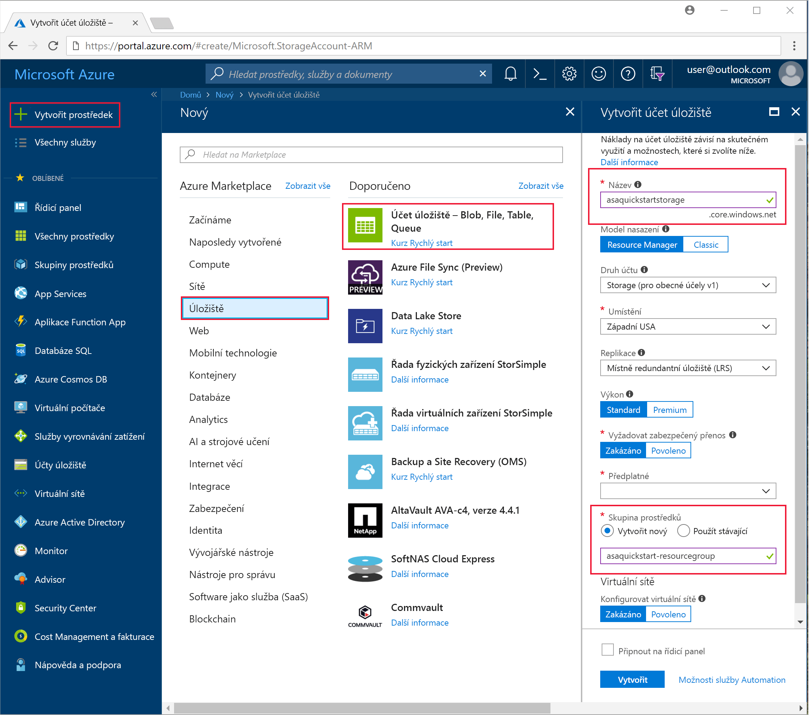
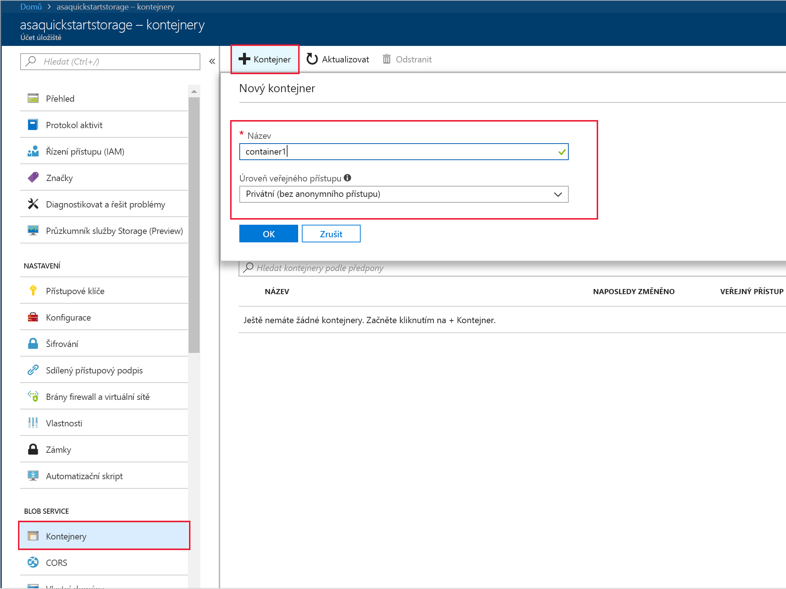
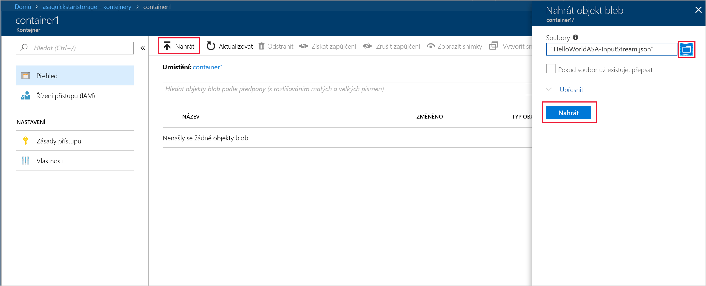
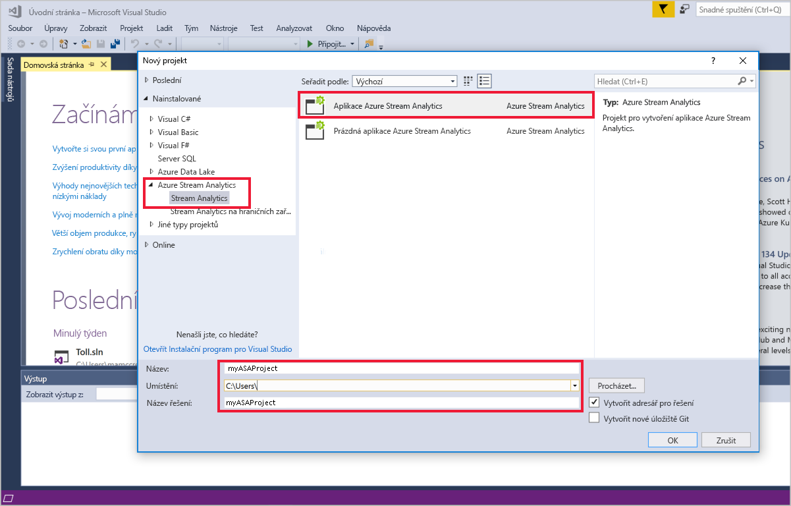
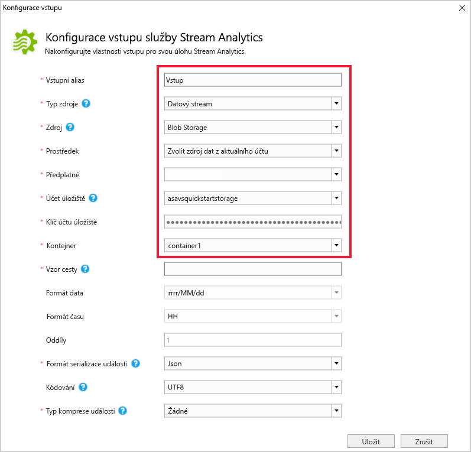
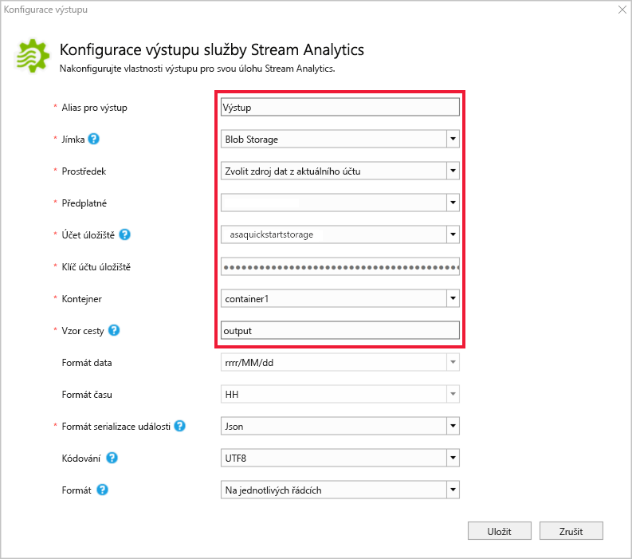
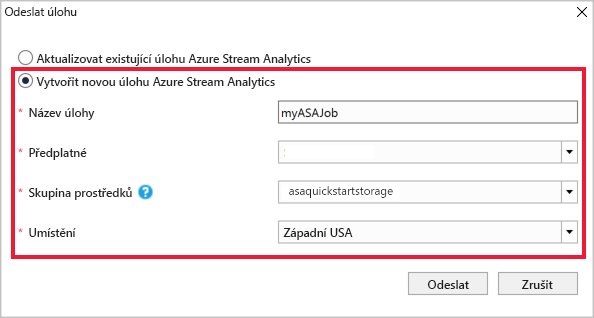
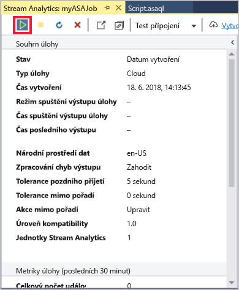
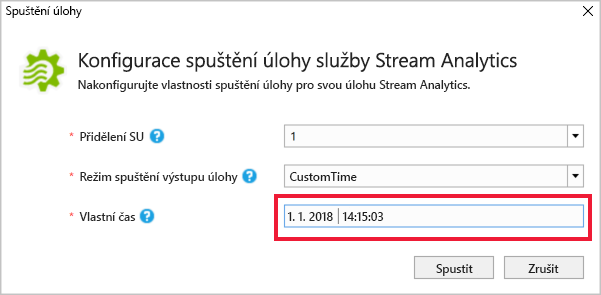
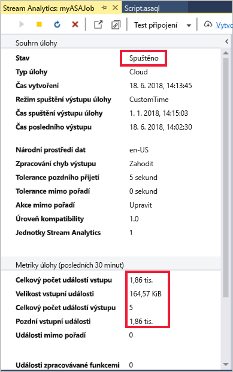

# <a name="quickstart-create-a-stream-analytics-job-by-using-the-azure-stream-analytics-tools-for-visual-studio"></a>Rychlý start: Vytvoření úlohy Stream Analytics pomocí Azure Stream Analytics Tools for Visual Studio

V tomto rychlém startu se dozvíte, jak vytvořit a spustit úlohu Stream Analytics pomocí Azure Stream Analytics Tools for Visual Studio. Ukázková úloha čte data streamovaná z úložiště objektů blob v Azure. Vstupní datový soubor použitý v tomto rychlém startu obsahuje statická data, která jsou určena pouze pro ilustraci. Ve skutečném scénáři použijete pro úlohu Stream Analytics streamovaná vstupní data. V tomto rychlém startu nadefinujete úlohu, která vypočítá průměrnou teplotu nad 100 ° a zapíše výsledné výstupní události do nového souboru.

## <a name="before-you-begin"></a>Než začnete

* Pokud ještě nemáte předplatné Azure, vytvořte si [bezplatný účet](https://azure.microsoft.com/free/).

* Přihlaste se k webu [Azure Portal](https://portal.azure.com/).

* Nainstalujte sadu Visual Studio 2017, Visual Studio 2015 nebo Visual Studio 2013 Update 4. Podporují se edice Enterprise (Ultimate nebo Premium), Professional a Community. Edice Express se nepodporuje.

* Postupujte podle [pokynů k instalaci](https://docs.microsoft.com/azure/stream-analytics/stream-analytics-tools-for-visual-studio-install) a nainstalujte Stream Analytics Tools for Visual Studio.

## <a name="prepare-the-input-data"></a>Příprava vstupních dat

Než začnete definovat úlohu Stream Analytics, připravte si data nakonfigurovaná jako vstup pro tuto úlohu. Pomocí následujících kroků si připravte vstupní data vyžadovaná úlohou:

1. Z GitHubu si stáhněte [vzorová data snímačů](https://raw.githubusercontent.com/Azure/azure-stream-analytics/master/Samples/GettingStarted/HelloWorldASA-InputStream.json). Tato data obsahují informace ze snímačů v uvedeném formátu JSON:  

   ```json
   {
     "time": "2018-01-26T21:18:52.0000000",
     "dspl": "sensorC",
     "temp": 87,
     "hmdt": 44
   }
   ```
2. Přihlaste se k webu [Azure Portal](https://portal.azure.com/).

3. V levém horním rohu webu Azure Portal vyberte **Vytvořit prostředek** > **Úložiště** > **Účet úložiště**. Vyplňte informace na stránce úlohy Účet úložiště a nastavte **Název** na asaquickstartstorage, **Umístění** na USA – západ a **Skupinu prostředků** na asaquickstart-resourcegroup (kvůli zajištění vyššího výkonu se účet úložiště hostuje ve stejné skupině prostředků jako úloha streamování). Ostatní nastavení můžou zůstat na výchozích hodnotách.  

   

4. Na stránce **Všechny prostředky** vyhledejte účet úložiště vytvořený v předchozím kroku. Otevřete stránku **Přehled** a potom dlaždici **Objekty blob**.  

5. Na stránce **Blob Service** vyberte **Kontejner**, zadejte **Název** kontejneru, například *container1*, a vyberte **OK**.  

   

6. Přejděte do kontejneru, který jste vytvořili v předchozím kroku. Vyberte **Nahrát** a nahrajte data snímače, která jste získali v prvním kroku.  

   

## <a name="create-a-stream-analytics-project"></a>Vytvoření projektu Stream Analytics

1. Spusťte Visual Studio.

2. Vyberte **Soubor > Nový projekt**.  

3. V seznamu šablon na levé straně vyberte **Stream Analytics** a pak vyberte **Aplikace Azure Stream Analytics**.  

4. Zadejte **Název** projektu, **Umístění** a **Název řešení** a vyberte **OK**.

   

Všimněte si prvků obsažených v projektu Azure Stream Analytics.

   


## <a name="choose-the-required-subscription"></a>Výběr požadovaného předplatného

1. V sadě Visual Studio v nabídce **Zobrazení** vyberte **Průzkumník serveru**.

2. Klikněte pravým tlačítkem na **Azure**, vyberte **Připojit k předplatnému Microsoft Azure** a pak se přihlaste pomocí svého účtu Azure.

## <a name="define-input"></a>Definice vstupu

1. V **Průzkumníku řešení** rozbalte uzel **Vstupy** a dvakrát klikněte na soubor **Input.json**.

2. Vyplňte okno **Konfigurace vstupu Stream Analytics** následujícími hodnotami:

   |**Nastavení**  |**Navrhovaná hodnota**  |**Popis**   |
   |---------|---------|---------|
   |Alias pro vstup  |  Vstup   |  Zadejte název pro identifikaci vstupu úlohy.   |
   |Typ zdroje   |  Datový proud |  Zvolte odpovídající vstupní zdroj: datový proud nebo referenční data.   |
   |Zdroj  |  Blob Storage |  Vyberte odpovídající vstupní zdroj.   |
   |Prostředek  | Zvolit zdroj dat z aktuálního účtu | Zvolte, jestli chcete data zadat ručně, nebo vyberte existující účet.   |
   |Předplatné  |  \<Vaše předplatné\>   | Zadejte předplatné Azure vytvořeného účtu úložiště. Účet úložiště můžete využívat v rámci stejného, ale i jiného předplatného. V tomto příkladu se předpokládá, že jste účet vytvořili v rámci stejného předplatného.   |
   |Účet úložiště  |  asaquickstartstorage   |  Vyberte nebo zadejte název účtu úložiště. Pokud jsou názvy vytvořeny v rámci stejného předplatného, zjišťují se automaticky.   |
   |Kontejner  |  container1   |  Vyberte existující kontejner, který jste vytvořili v účtu úložiště.   |
   
3. U ostatních možností ponechejte výchozí hodnoty a výběrem možnosti **Uložit** uložte nastavení.  

   

## <a name="define-output"></a>Definice výstupu

1. V **Průzkumníku řešení** rozbalte uzel **Výstupy** a dvakrát klikněte na soubor **Output.json**.

2. Vyplňte okno **Konfigurace výstupu Stream Analytics** následujícími hodnotami:

   |**Nastavení**  |**Navrhovaná hodnota**  |**Popis**   |
   |---------|---------|---------|
   |Alias pro výstup  |  Výstup   |  Zadejte název pro identifikaci výstupu úlohy.   |
   |Jímka   |  Blob Storage |  Zvolte odpovídající jímku.    |
   |Prostředek  |  Zadat nastavení zdroje dat ručně |  Zvolte, jestli chcete data zadat ručně, nebo vyberte existující účet.   |
   |Předplatné  |  \<Vaše předplatné\>   | Zadejte předplatné Azure vytvořeného účtu úložiště. Účet úložiště můžete využívat v rámci stejného, ale i jiného předplatného. V tomto příkladu se předpokládá, že jste účet vytvořili v rámci stejného předplatného.   |
   |Účet úložiště  |  asaquickstartstorage   |  Vyberte nebo zadejte název účtu úložiště. Pokud jsou názvy vytvořeny v rámci stejného předplatného, zjišťují se automaticky.   |
   |Kontejner  |  container1   |  Vyberte existující kontejner, který jste vytvořili v účtu úložiště.   |
   |Vzor cesty  |  output   |  Zadejte název cesty k souboru, která se vytvoří v rámci kontejneru.   |
   
3. U ostatních možností ponechejte výchozí hodnoty a výběrem možnosti **Uložit** uložte nastavení.  

   

## <a name="define-the-transformation-query"></a>Definice transformačního dotazu

1. V **Průzkumníku řešení** v sadě Visual Studio otevřete soubor **Script.asaql**.

2. Přidejte následující dotaz:

   ```sql
   SELECT 
   System.Timestamp AS OutputTime,
   dspl AS SensorName,
   Avg(temp) AS AvgTemperature
   INTO
     Output
   FROM
     Input TIMESTAMP BY time
   GROUP BY TumblingWindow(second,30),dspl
   HAVING Avg(temp)>100
   ```

## <a name="submit-a-stream-analytics-query-to-azure"></a>Odeslání dotazu Stream Analytics do Azure

1. V **Editoru dotazů** vyberte **Odeslat do Azure**.

2. Vyberte **Vytvořit novou úlohu Azure Stream Analytics** a zadejte **Název úlohy**. Zvolte **Předplatné**, **Skupinu prostředků** a **Umístění**, které jste použili na začátku tohoto rychlého startu.

   

## <a name="start-the-stream-analytics-job-and-check-output"></a>Spuštění úlohy Stream Analytics a kontrola výstupu

1. Po vytvoření úlohy se automaticky otevře zobrazení úlohy. Výběrem tlačítka se zelenou šipkou spusťte úlohu.

   

2. Změňte datum v poli **Vlastní čas** na `2018-01-01` a vyberte **Spustit**.

   

3. Všimněte si, že se stav úlohy změnil na **Spuštěno** a zobrazují se vstupní a výstupní události. Může to trvat několik minut.

   

4. Pokud chcete zobrazit výsledky, v nabídce **Zobrazení** vyberte **Průzkumník cloudu** a přejděte do účtu úložiště ve vaší skupině prostředků. V části **Kontejnery objektů blob** dvakrát klikněte na kontejner **container1** a pak na cestu k **výstupnímu** souboru.

   

## <a name="clean-up-resources"></a>Vyčištění prostředků

Odstraňte skupinu prostředků, úlohu streamování a všechny související prostředky, pokud je už nepotřebujete. Odstraněním úlohy se zabrání zaúčtování jednotek streamování, které daná úloha spotřebovává. Pokud plánujete používat tuto úlohu v budoucnu, můžete ji zastavit a znovu ji spustit později, až ji budete potřebovat. Pokud nebudete tuto úlohu nadále používat, odstraňte všechny prostředky vytvořené podle tohoto rychlého startu pomocí následujícího postupu:

1. V nabídce vlevo na portálu Azure Portal vyberte **Skupiny prostředků** a potom zvolte název vytvořeného prostředku.  

2. Na stránce skupiny prostředků zvolte **Odstranit**, do textového pole zadejte prostředek, který chcete odstranit, a potom vyberte **Odstranit**.

## <a name="next-steps"></a>Další kroky

V tomto rychlém startu jste nasadili jednoduchou úlohu Stream Analytics. Pokud se chcete dozvědět o konfiguraci dalších vstupních zdrojů a provádění detekce v reálném čase, pokračujte na další článek:

> [!div class="nextstepaction"]
> [Zjišťování možných podvodů v reálném čase pomocí Stream Analytics](stream-analytics-real-time-fraud-detection.md)
