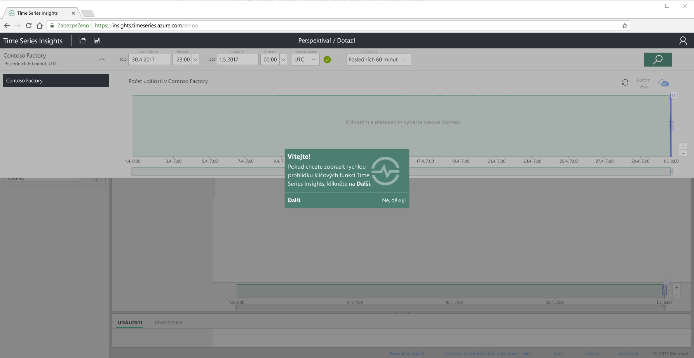
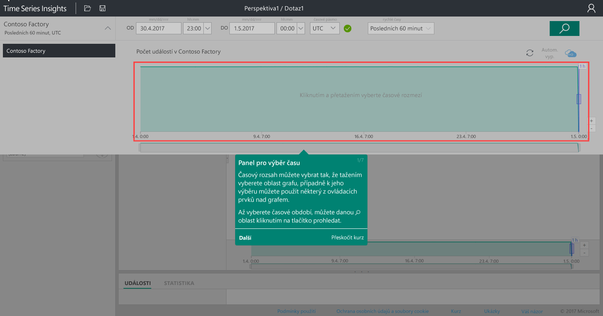
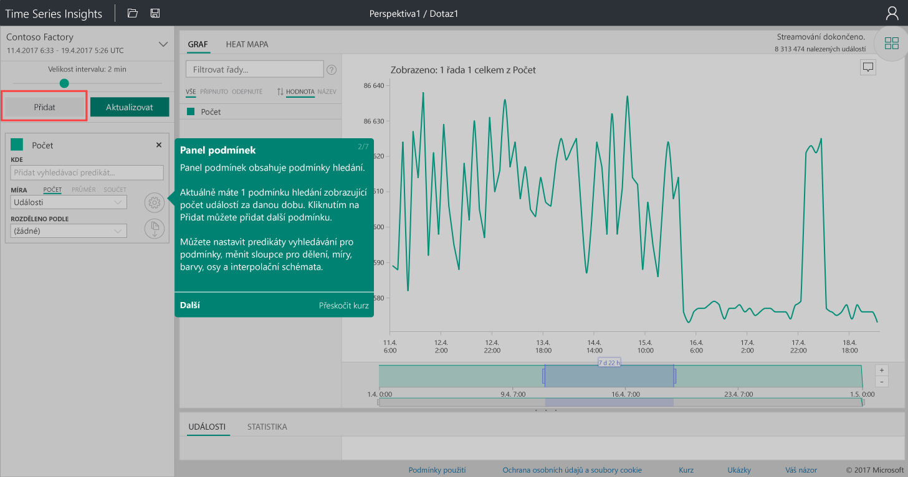
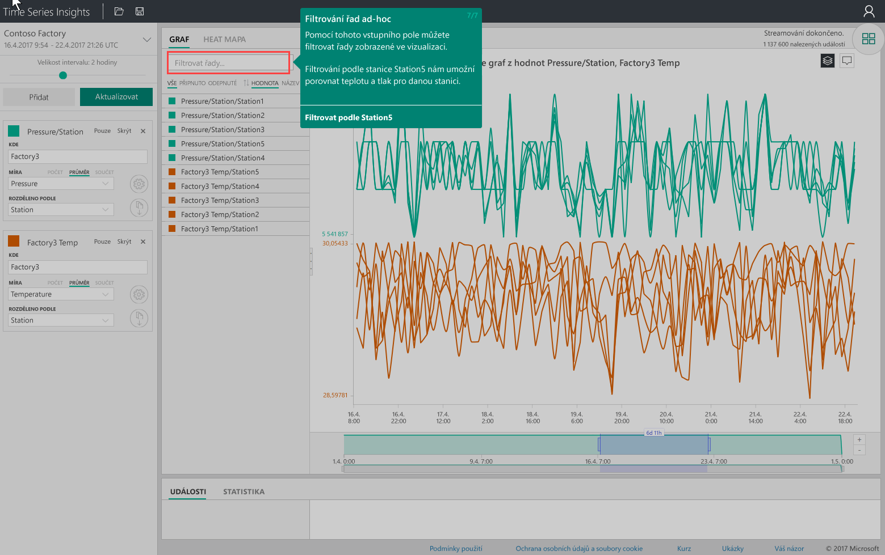

# Rychlý úvod: Prozkoumat Statistika Azure časové řady
Tento rychlý start se dozvíte, jak začít pracovat s explorer Statistika řady čas Azure v prostředí volné ukázka. Další informace o použití je webový prohlížeč vizualizovat velké objemy dat IoT a prohlídka klíčové funkce Průzkumníku Statistika časové řady. 

Azure Time Series Insights je plně spravovaná služba pro analýzy, ukládání a vizualizace, která usnadňuje zkoumání a analýzy miliard událostí IoT současně. Poskytuje globální zobrazení dat, takže můžete rychle ověřit řešení IoT a vyhnout nákladným odstávkám důležité zařízení tím, že můžete zjistit skrytá trendy, pomáhá přímé anomálií a provedení analýzy příčin skoro v reálném čase.  Pokud vytváříte aplikace, která data řady čas úložiště nebo dotaz, je potřeba, můžete vyvíjet pomocí REST API pro přehledy čas řady.

Pokud ještě nemáte předplatné Azure, vytvořte si [bezplatný účet Azure](https://azure.microsoft.com/free/?ref=microsoft.com&utm_source=microsoft.com&utm_medium=docs&utm_campaign=visualstudio) před tím, než začnete.

## Prozkoumejte explorer časové řady statistiky v ukázce prostředí

1. V prohlížeči přejděte na [https://insights.timeseries.azure.com/demo](https://insights.timeseries.azure.com/demo). 

2. Pokud budete vyzváni, přihlaste se do Průzkumníka časové řady statistika pomocí svých přihlašovacích údajů účtu Azure. 
 
3. Zobrazí se stránka stručný přehled časové řady. Klikněte na tlačítko **Další** zahájíte stručný přehled.

   

4. **Panel výběru čas** se zobrazí. Pomocí tohoto panelu vyberte časový rámec pro vizualizaci.

   

5. Klikněte na tlačítko a přetáhněte ji v oblasti a pak klikněte na **vyhledávání** tlačítko.
 
    

   Statistika řady čas zobrazí graf vizualizace pro časový rámec, který jste zadali. Různé akce v rámci s spojnicový graf, jako je například filtrování, můžete provést Připnutí, řazení a skládání. 

   Se vrátíte do **panel výběru čas**, klikněte na šipku dolů, jak je znázorněno:

   

6. Klikněte na tlačítko **přidat** v **podmínky panely** přidat nové hledaný termín.

   

7. V grafu, můžete vybrat oblast, klikněte pravým tlačítkem na oblast a vyberte **prozkoumat události**.
 
   

   Mřížka nezpracovaná data budou zobrazena ze oblast, kterou zkoumáte:

   

8. Upravit vaše podmínky ke změně hodnot v grafu a přidejte jiný termín k cross porovnejte různé typy hodnot:

   

9. Zadejte termín filtru v **filtrovat řady...**  pole pro filtrování ad hoc řady. Pro rychlý start, zadejte **Station5** k korelace mezi teploty a přetížení pro příslušné stanici.
 
   

Po dokončení rychlé spuštění, můžete experimentovat s datovou sadou ukázka vytvořit různé vizualizace. 

### Další kroky
Jste připraveni vytvořit prostředí časové řady statistiky:
> [!div class="nextstepaction"]
> [Plánování prostředí Statistika časové řady](time-series-insights-environment-planning.md)
