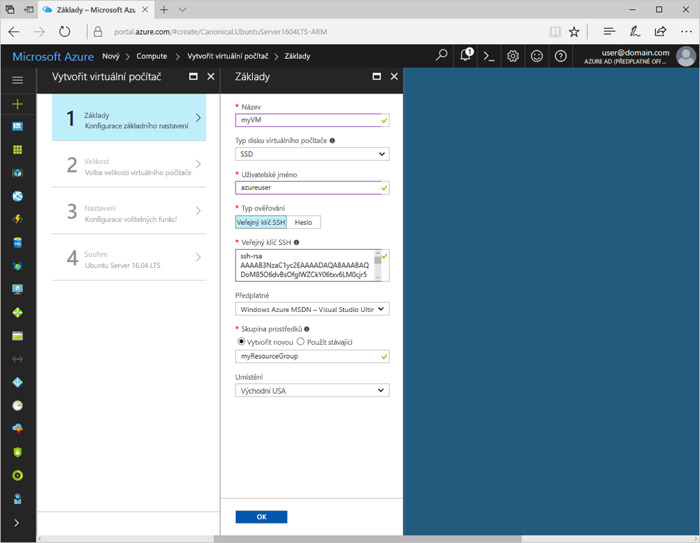
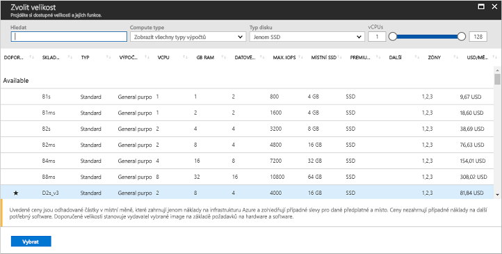

# <a name="create-a-linux-virtual-machine-with-the-azure-portal"></a>Vytvoření virtuálního počítače s Linuxem pomocí webu Azure Portal

Virtuální počítače Azure je možné vytvářet na webu Azure Portal. Tato metoda poskytuje uživatelské rozhraní v prohlížeči, pomocí kterého můžete vytvářet a konfigurovat virtuální počítače a všechny související prostředky. Tento Rychlý start prochází jednotlivé kroky k vytvoření virtuálního počítače a instalaci webového serveru na virtuálním počítači.

Pokud ještě nemáte předplatné Azure, vytvořte si [bezplatný účet](https://azure.microsoft.com/free/?WT.mc_id=A261C142F) před tím, než začnete.

## <a name="create-ssh-key-pair"></a>Vytvoření páru klíčů SSH

K dokončení tohoto rychlého startu potřebujete pár klíčů SSH. Pokud máte existující pár klíčů SSH, můžete tento krok přeskočit.

Z prostředí Bash spusťte tento příkaz a postupujte podle pokynů na obrazovce. Výstup příkazu zahrnuje název souboru veřejného klíče. Zkopírujte obsah souboru veřejného klíče (`cat ~/.ssh/id_rsa.pub`) do schránky. Pokud použijete subsystém Windows pro Linux, ověřte, že nekopírujete znaky konce řádku z výstupu. Poznamenejte si název souboru privátního klíče pro pozdější použití.

```bash
ssh-keygen -t rsa -b 2048
```

Podrobnější informace o tomto procesu najdete [tady](https://docs.microsoft.com/azure/virtual-machines/linux/mac-create-ssh-keys)

## <a name="log-in-to-azure"></a>Přihlášení k Azure 

Přihlaste se k webu Azure Portal na adrese http://portal.azure.com.

## <a name="create-virtual-machine"></a>Vytvoření virtuálního počítače

1. Klikněte na **Vytvořit prostředek** v levém horním rohu webu Azure Portal.

2. Vyberte **Compute** a potom vyberte **Ubuntu Server 16.04 LTS**. 

3. Zadejte informace o virtuálním počítači. Jako **Typ ověřování** vyberte **Veřejný klíč SSH**. Při vkládání veřejného klíče SSH nezapomeňte odebrat počáteční a koncové prázdné znaky. Jakmile budete hotovi, klikněte na **OK**.

    

4. Vyberte velikost virtuálního počítače. Pokud chcete zobrazit další velikosti, vyberte **Zobrazit všechny** nebo změňte filtr **Podporovaný typ disku**. 

      

5. V části **Nastavení** ponechte výchozí nastavení a klikněte na **OK**.

6. Na stránce Souhrn kliknutím na **Ok** spusťte nasazení virtuálního počítače.

7. Virtuální počítač se připne na řídicí panel webu Azure Portal. Po dokončení nasazení se automaticky otevře souhrn virtuálního počítače.


## <a name="connect-to-virtual-machine"></a>Připojení k virtuálnímu počítači

Vytvořte připojení SSH k virtuálnímu počítači.

1. Klikněte na tlačítko **Připojit** ve vlastnostech virtuálního počítače. Tlačítko Připojit zobrazí připojovací řetězec SSH, pomocí kterého se můžete připojit k virtuálnímu počítači.

     

2. Spuštěním následujícího příkazu vytvořte relaci SSH. Nahraďte připojovací řetězec tím, který jste zkopírovali z webu Azure Portal.

```bash 
ssh azureuser@40.112.21.50
```

## <a name="install-nginx"></a>Instalace serveru NGINX

Pomocí následujícího skriptu bash provedete aktualizaci zdrojů balíčku a nainstalujete nejnovější balíček NGINX. 

```bash 
#!/bin/bash

# update package source
sudo apt-get -y update

# install NGINX
sudo apt-get -y install nginx
```

Až budete hotovi, ukončete relaci SSH a vraťte se do vlastností virtuálního počítače na webu Azure Portal.


## <a name="open-port-80-for-web-traffic"></a>Otevření portu 80 pro webový provoz 

Skupina zabezpečení sítě (NSG) zabezpečuje příchozí a odchozí provoz. Když se virtuální počítač vytvoří na webu Azure Portal, pro připojení SSH se vytvoří příchozí pravidlo na portu 22. Protože je tento virtuální počítač hostitelem webového serveru, je potřeba vytvořit pravidlo NSG pro port 80.

1. Na virtuálním počítači klikněte na název **skupiny prostředků**.
2. Vyberte **skupinu zabezpečení sítě**. NSG můžete identifikovat pomocí sloupce **Typ**. 
3. V nabídce vlevo v části Nastavení klikněte na **Příchozí pravidla zabezpečení**.
4. Klikněte na **Přidat**.
5. Do pole **Název** zadejte **http**. Ověřte, že **Rozsah zdrojových portů** je nastavený na `*`, **Rozsah cílových portů** je nastavený na *80* a **Akce** je nastavená na *Povolit*. 
6. Klikněte na **OK**.


## <a name="view-the-nginx-welcome-page"></a>Zobrazení úvodní stránky serveru NGINX

Když je teď NGINX nainstalovaný a port 80 k virtuálnímu počítači otevřený, webový server je přístupný z internetu. Otevřete webový prohlížeč a zadejte veřejnou IP adresu virtuálního počítače. Veřejnou IP adresu najdete ve vlastnostech virtuálního počítače na webu Azure Portal.

 

## <a name="clean-up-resources"></a>Vyčištění prostředků

Pokud už je nepotřebujete, odstraňte skupinu prostředků, virtuální počítač a všechny související prostředky. Provedete to tak, že vyberete skupinu prostředků virtuálního počítače a kliknete na **Odstranit**.

## <a name="next-steps"></a>Další kroky

V tomto Rychlém startu jste nasadili jednoduchý virtuální počítač a pravidlo skupiny zabezpečení sítě a nainstalovali jste webový server. Další informace o virtuálních počítačích Azure najdete v kurzu pro virtuální počítače s Linuxem.

> [!div class="nextstepaction"]
> [Kurzy pro virtuální počítače Azure s Linuxem](./tutorial-manage-vm.md)
