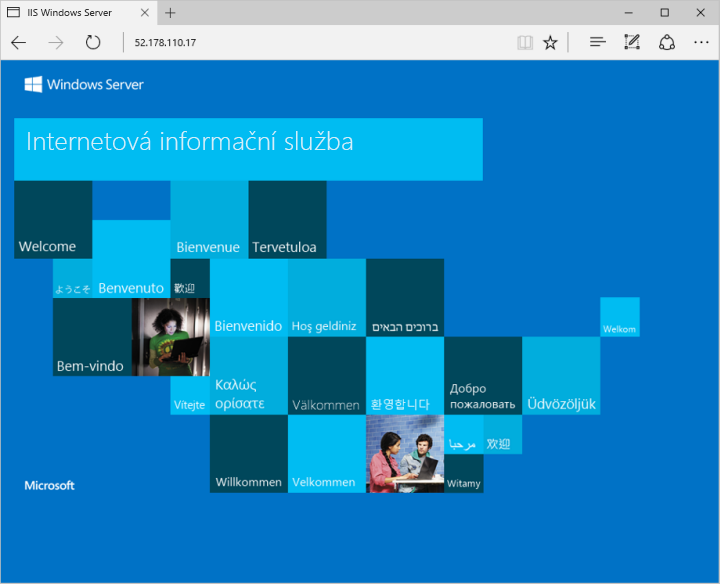

# <a name="create-a-windows-virtual-machine-with-the-azure-portal"></a>Vytvoření virtuálního počítače s Windows pomocí webu Azure Portal

Virtuální počítače Azure je možné vytvářet na webu Azure Portal. Tato metoda poskytuje uživatelské rozhraní v prohlížeči, pomocí kterého můžete vytvářet a konfigurovat virtuální počítače a všechny související prostředky. Tento Rychlý start prochází jednotlivé kroky k vytvoření virtuálního počítače pomocí webu Azure Portal. Po dokončení nasazení se připojíme k serveru a nainstalujeme službu IIS.

Pokud ještě nemáte předplatné Azure, vytvořte si [bezplatný účet](https://azure.microsoft.com/free/) před tím, než začnete.

## <a name="log-in-to-azure"></a>Přihlaste se k Azure.

Přihlaste se k webu Azure Portal na adrese http://portal.azure.com.

## <a name="create-virtual-machine"></a>Vytvoření virtuálního počítače

2. Klikněte na tlačítko **Nový** v levém horním rohu webu Azure Portal.

3. V okně **Nový** vyberte **Compute**, v okně **Compute** vyberte **Windows Server 2016 Datacenter** a potom klikněte na tlačítko **Vytvořit**.

4. Vyplňte formulář **Základní informace** o virtuálním počítači. Uživatelské jméno a heslo, které tady zadáte, se používá k přihlášení k virtuálnímu počítači. V části **Skupina prostředků** vytvořte novou. Skupina prostředků je logický kontejner, ve kterém se vytváří a hromadně spravují prostředky Azure. Jakmile budete hotovi, klikněte na **OK**.

      

5. Zvolte velikost virtuálního počítače a klikněte na **Vybrat**.

6. V okně Nastavení v části **Použít spravované disky** vyberte **Ano**, pro zbytek nastavení ponechte výchozí hodnoty a klikněte na **OK**.

7. Na stránce Souhrn kliknutím na **Ok** spusťte nasazení virtuálního počítače.

8. Chcete-li monitorovat stav nasazení, klikněte na virtuální počítač. Virtuální počítač najdete na webu Azure Portal na řídicím panelu nebo výběrem možnosti **Virtual Machines** z nabídky vlevo. Po vytvoření virtuálního počítače se stav se změní z **Nasazování** na **Spuštěno**.

## <a name="open-port-80-for-web-traffic"></a>Otevření portu 80 pro webový provoz 

Pokud chcete povolit provoz pro službu IIS, musíte otevřít port 80 pro webový provoz. Tento krok vás provede procesem vytvoření pravidla skupiny zabezpečení sítě (NSG), aby byla možná příchozí připojení na portu 80.

1. V okně pro virtuální počítač v části **Základy** klikněte na název **skupiny prostředků**.
2. V okně pro skupinu prostředků klikněte v seznamu prostředků na **Skupina zabezpečení sítě**. Název skupiny NSG musí být název virtuálního počítače s příponou -nsg.
3. Klikněte na záhlaví **Příchozí pravidlo zabezpečení** a otevřete seznam příchozích pravidel. V seznamu byste už měli vidět pravidlo pro protokol RDP.
4. Klikněte na **+ Přidat** a otevřete okno **Přidat příchozí pravidlo zabezpečení**.
5. Do pole **Název** zadejte **IIS** a zkontrolujte, že **Rozsah portů** je nastavený na 80 a **Akce** je nastavená na **Povolit**, a pak klikněte na **OK**.


## <a name="connect-to-virtual-machine"></a>Připojení k virtuálnímu počítači

Po dokončení nasazení vytvořte připojení ke vzdálené ploše virtuálního počítače.

1. Klikněte na tlačítko **Vytvořit** v okně virtuálního počítače. Vytvoří a stáhne se soubor protokolu RDP (Remote Desktop Protocol) – soubor .rdp.

     

2. Chcete-li se připojit k virtuálnímu počítači, otevřete stažený soubor protokolu RDP. Pokud se zobrazí výzva, klikněte na **Připojit**. Na počítači Mac budete potřebovat klienta protokolu RDP, jako je například tento [Klient vzdálené plochy](https://itunes.apple.com/us/app/microsoft-remote-desktop/id715768417?mt=12) na Mac App Storu.

3. Zadejte uživatelské jméno a heslo, které jste zadali při vytváření virtuálního počítače, a potom klikněte na **Ok**.

4. Během procesu přihlášení se může zobrazit upozornění certifikátu. Klikněte na **Ano** nebo **Pokračovat** a pokračujte v připojení.


## <a name="install-iis-using-powershell"></a>Instalace služby IIS pomocí PowerShellu

Když jste přihlášení k virtuálnímu počítači Azure, můžete k instalaci IIS a k aktivace pravidla místní brány firewall pro povolení webového provozu použít jeden řádek PowerShellu.  Otevřete příkazový řádek PowerShellu a spusťte následující příkaz:

```powershell
Install-WindowsFeature -name Web-Server -IncludeManagementTools
```

## <a name="view-the-iis-welcome-page"></a>Zobrazení úvodní stránky služby IIS

S nainstalovanou službou IIS na virtuálním počítači a nyní otevřeným portem 80 z internetu můžete použít libovolný webový prohlížeč a zobrazit výchozí úvodní stránku služby IIS. Získejte **veřejnou IP adresu** v okně pro virtuální počítač a použijte ji k navštívení výchozí webové stránky. 

 

## <a name="delete-virtual-machine"></a>Odstranění virtuálního počítače

Pokud už je nepotřebujete, můžete k odebrání skupiny prostředků, virtuálního počítače a všech souvisejících prostředků použít následující příkaz.

```powershell
Remove-AzureRmResourceGroup -Name myResourceGroup
```
## <a name="delete-virtual-machine"></a>Odstranění virtuálního počítače

Pokud už je nepotřebujete, odstraňte skupinu prostředků, virtuální počítač a všechny související prostředky. Provedete to tak, že v okně virtuálního počítače vyberete skupinu prostředků a kliknete na **Odstranit**.

## <a name="next-steps"></a>Další kroky

[Kurz instalace role a konfigurace brány firewall](hero-role.md?toc=%2fazure%2fvirtual-machines%2fwindows%2ftoc.json)

[Prozkoumejte ukázky nasazení virtuálního počítače pomocí rozhraní příkazového řádku](cli-samples.md?toc=%2fazure%2fvirtual-machines%2fwindows%2ftoc.json)

