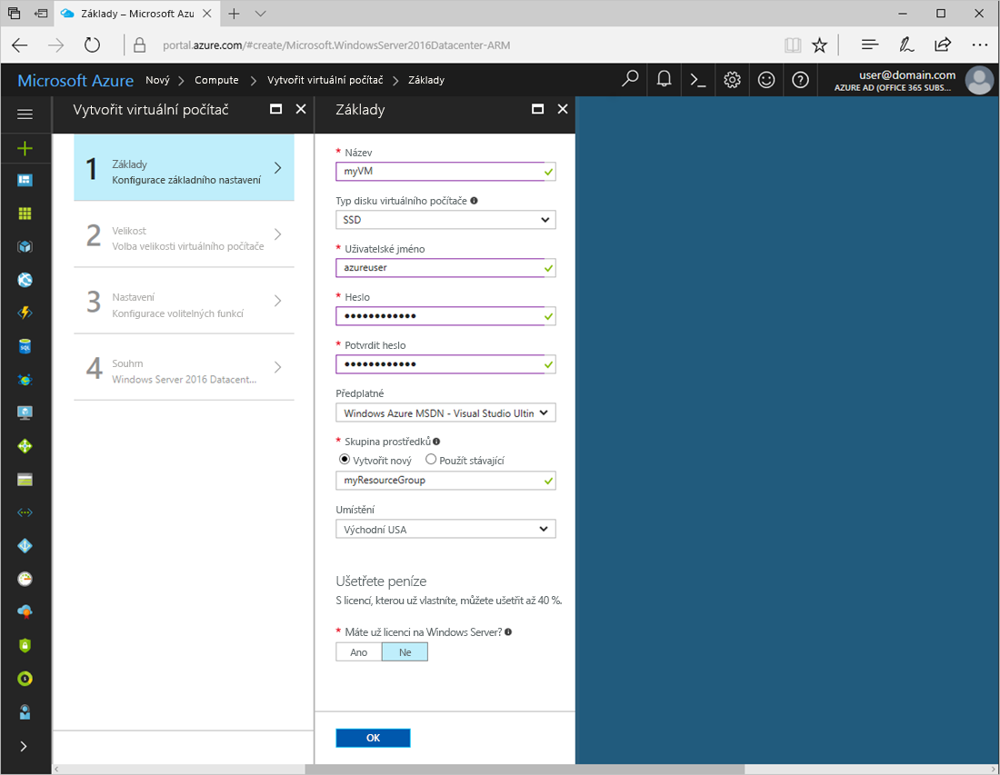
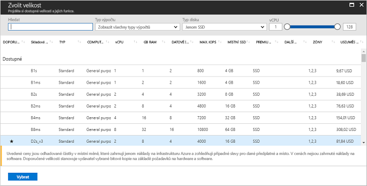

# <a name="quickstart-create-a-windows-virtual-machine-in-the-azure-portal"></a>Rychlý start: Vytvoření virtuálního počítače s Windows na webu Azure Portal

Virtuální počítače Azure je možné vytvářet na webu Azure Portal. Tato metoda poskytuje uživatelské rozhraní v prohlížeči, pomocí kterého můžete vytvářet virtuální počítače a jejich související prostředky. V tomto rychlém startu se dozvíte, jak pomocí webu Azure Portal nasadit do Azure virtuální počítač s Windows Serverem 2016. Pak se k virtuálnímu počítači připojíte přes protokol RDP a nainstalujete na něj webový server služby IIS, abyste virtuální počítač viděli v akci.

Pokud ještě nemáte předplatné Azure, vytvořte si [bezplatný účet](https://azure.microsoft.com/free/?WT.mc_id=A261C142F) před tím, než začnete.

## <a name="log-in-to-azure"></a>Přihlášení k Azure

Přihlaste se k webu Azure Portal na adrese https://portal.azure.com.

## <a name="create-virtual-machine"></a>Vytvoření virtuálního počítače

1. V levém horním rohu webu Azure Portal zvolte **Vytvořit prostředek**.

2. Ve vyhledávacím poli nad seznamem prostředků Azure Marketplace vyhledejte a vyberte **Windows Server 2016 Datacenter** a pak zvolte **Vytvořit**.

3. Zadejte název virtuálního počítače, například *myVM*, jako typ disku ponechte *SSD* a zadejte uživatelské jméno, například *azureuser*. Heslo musí obsahovat nejméně 12 znaků a musí splňovat [zadané požadavky na složitost](faq.md#what-are-the-password-requirements-when-creating-a-vm).

    

5. Zvolte možnost **Vytvořit novou** skupinu prostředků a zadejte její název, například *myResourceGroup*. Zvolte požadované **Umístění** a pak vyberte **OK**.

4. Vyberte velikost virtuálního počítače. Můžete filtrovat například podle *Typu výpočtu* nebo *Typu disku*. Navrhovaná velikost virtuálního počítače je *D2s_v3*.

    

5. V části **Nastavení** ponechte výchozí hodnoty a vyberte **OK**.

6. Na stránce Souhrn výběrem možnosti **Vytvořit** spusťte nasazení virtuálního počítače.

7. Virtuální počítač se připne na řídicí panel webu Azure Portal. Po dokončení nasazení se automaticky otevře souhrn virtuálního počítače.

## <a name="connect-to-virtual-machine"></a>Připojení k virtuálnímu počítači

Vytvořte připojení ke vzdálené ploše virtuálního počítače. Tyto pokyny popisují připojení k virtuálnímu počítači z počítače z Windows. Na počítači Mac budete potřebovat klienta protokolu RDP, jako je například tento [Klient vzdálené plochy](https://itunes.apple.com/us/app/microsoft-remote-desktop/id715768417?mt=12) na Mac App Storu.

1. Na stránce vlastností virtuálního počítače klikněte na tlačítko **Připojit**. 

    
    
2. Na stránce **Připojení k virtuálnímu počítači** ponechte výchozí výběr možností pro připojení podle názvu DNS přes port 3389 a klikněte na **Stáhnout soubor RDP**.

2. Otevřete stažený soubor RDP a po zobrazení výzvy klikněte na **Připojit**. 

3. V okně **Zabezpečení systému Windows** vyberte **Další možnosti** a pak **Použít jiný účet**. Zadejte uživatelské jméno ve formátu *název_virtuálního_počítače*\*uživatelské_jméno* a heslo, které jste pro virtuální počítač vytvořili, a pak klikněte na **OK**.

4. Během procesu přihlášení se může zobrazit upozornění certifikátu. Klikněte na **Ano** nebo **Pokračovat** a pokračujte v připojení.

## <a name="install-web-server"></a>Instalace webového serveru

Pokud se chcete podívat na virtuální počítač v akci, nainstalujte webový server služby IIS. Ve virtuálním počítači otevřete příkazový řádek PowerShellu a spusťte následující příkaz:

```powershell
Install-WindowsFeature -name Web-Server -IncludeManagementTools
```

Jakmile budete hotovi, ukončete připojení RDP k virtuálnímu počítači.

## <a name="open-port-80-for-web-traffic"></a>Otevření portu 80 pro webový provoz

Skupina zabezpečení sítě (NSG) zabezpečuje příchozí a odchozí provoz. Když se virtuální počítač vytvoří na webu Azure Portal, pro připojení ke vzdálené ploše se vytvoří příchozí pravidlo na portu 3389. Protože je tento virtuální počítač hostitelem webového serveru, je potřeba vytvořit pravidlo NSG pro port 80.

1. Na stránce přehledu virtuálního počítače vyberte **Sítě**.
2. Zobrazí se seznam existujících příchozích a odchozích pravidel. Zvolte **Přidat pravidlo portu pro příchozí provoz**.
3. V horní části vyberte možnost **Basic** a pak v seznamu dostupných služeb zvolte *HTTP*. Port 80, priorita a název už jsou zadané.
4. Pravidlo vytvoříte výběrem možnosti **Přidat**.

## <a name="view-the-iis-welcome-page"></a>Zobrazení úvodní stránky služby IIS

S nainstalovanou službou IIS na virtuálním počítači a nyní otevřeným portem 80 z internetu můžete použít libovolný webový prohlížeč a zobrazit výchozí úvodní stránku služby IIS. Použijte veřejnou IP adresu virtuálního počítače, kterou jste získali v předchozím kroku. Následující příklad ukazuje výchozí webovou stránku služby IIS:


## <a name="clean-up-resources"></a>Vyčištění prostředků

Pokud už je nepotřebujete, můžete odstranit skupinu prostředků, virtuální počítač a všechny související prostředky. Provedete to tak, že vyberete skupinu prostředků pro příslušný virtuální počítač, vyberete **Odstranit** a pak potvrdíte název skupiny prostředků, kterou chcete odstranit.

## <a name="next-steps"></a>Další kroky

V tomto rychlém startu jste nasadili jednoduchý virtuální počítač, otevřeli jste síťový port pro webový provoz a nainstalovali jste základní webový server. Další informace o virtuálních počítačích Azure najdete v kurzu pro virtuální počítače s Windows.

> [!div class="nextstepaction"]
> [Kurzy pro virtuální počítače Azure s Windows](./tutorial-manage-vm.md)
