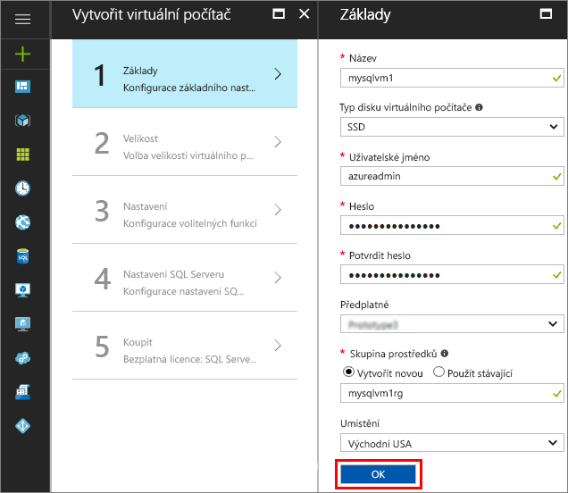
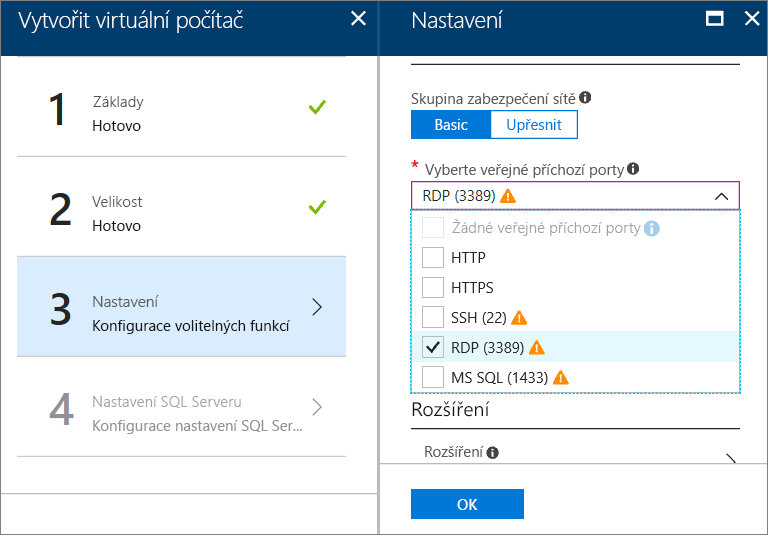
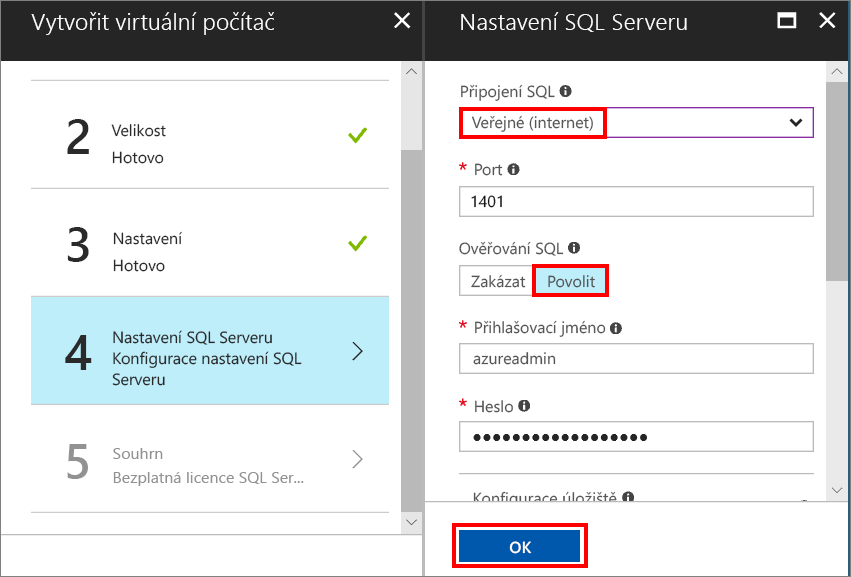
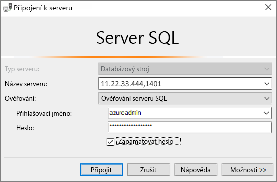

# Rychlý start: Vytvoření virtuálního počítače s Windows a SQL Serverem 2017 na webu Azure Portal

> [!div class="op_single_selector"]
> * [Windows](quickstart-sql-vm-create-portal.md)
> * [Linux](../../linux/sql/provision-sql-server-linux-virtual-machine.md)

Tento rychlý start vás provede vytvořením virtuálního počítače s SQL Serverem na webu Azure Portal.

> [!TIP]
> Tento rychlý start obsahuje postup pro rychlé zřízení virtuálního počítače SQL a připojení k němu. Další informace o jiných možnostech zřizování virtuálních počítačů SQL najdete v tématu [Průvodce zřizováním virtuálních počítačů s Windows a SQL Serverem na webu Azure Portal](virtual-machines-windows-portal-sql-server-provision.md).

> [!TIP]
> Pokud máte dotazy k virtuálním počítačům s SQL Serverem, přečtěte si [Nejčastější dotazy](virtual-machines-windows-sql-server-iaas-faq.md).

## Získání předplatného Azure

Pokud ještě nemáte předplatné Azure, vytvořte si [bezplatný účet](https://azure.microsoft.com/free/?WT.mc_id=A261C142F) před tím, než začnete.

##  Výběr image virtuálního počítače s SQL Serverem

1. Přihlaste se k webu [Azure Portal](https://portal.azure.com) pomocí svého účtu.

1. Na webu Azure Portal klikněte na **Vytvořit prostředek**. 

1. Do vyhledávacího pole zadejte **SQL Server 2017 Developer on Windows Server 2016** a stiskněte ENTER.

1. Vyberte image **Bezplatná licence SQL Serveru: SQL Server 2017 Developer ve Windows Serveru 2016**.

   

   > [!TIP]
   > V tomto kurzu se používá edice Developer, protože je to plná verze SQL Serveru, která je zdarma pro účely testování vývoje. Platíte jenom náklady na provozování virtuálního počítače. Kompletní informace o cenách najdete v [doprovodných materiálech k cenám pro virtuální počítače Azure s SQL Serverem](virtual-machines-windows-sql-server-pricing-guidance.md).

1. Klikněte na možnost **Vytvořit**.

##  Poskytnutí základních informací

V okně **Základy** zadejte následující informace:

1. Do pole **Název** zadejte jedinečný název virtuálního počítače. 

1. Do pole **Uživatelské jméno** zadejte jméno pro účet místního správce ve virtuálním počítači.

1. Zadejte silné **heslo**.

1. Zadejte nový název pro **skupinu prostředků**. Tato skupina pomáhá spravovat všechny prostředky přidružené k virtuálnímu počítači.

1. Ověřte ostatní výchozí nastavení a pokračujte kliknutím na **OK**.

   

## Volba velikosti virtuálního počítače

1. V kroku **Velikost** zvolte velikost virtuálního počítače v okně **Zvolit velikost**.

   Pro účely tohoto rychlého startu vyberte **D2S_V3**. Portál zobrazí odhadované měsíční náklady při nepřetržitém užívání (nezahrnují licenční náklady na SQL Server). Nezapomeňte, že u verze Developer Edition se žádné další licenční poplatky za SQL Server neúčtují. Konkrétnější informace o cenách najdete na [stránce s cenami](https://azure.microsoft.com/pricing/details/virtual-machines/windows/).

   > [!TIP]
   > Velikost počítače **D2S_V3** zajišťuje úsporu nákladů při testování. Doporučené velikosti a konfiguraci počítačů pro produkční úlohy najdete v tématu [Osvědčené postupy z hlediska výkonu pro SQL Server na virtuálních počítačích Azure](virtual-machines-windows-sql-performance.md).

1. Pokračujte kliknutím na **Vybrat**.

## Konfigurace volitelných funkcí

1. Pokud se chcete připojit ke vzdálené ploše virtuálního počítače, v okně **Nastavení** v seznamu **Vybrat veřejné příchozí porty** vyberte port **RDP (3389)**.

   

   > [!NOTE]
   > Pokud chcete získat vzdálený přístup k SQL Serveru, můžete vybrat port **MS SQL (1433)**. To však není nezbytné, protože tato možnost je k dispozici i v kroku **Nastavení SQL Serveru**. Pokud v tomto kroku vyberete port 1433, otevře se bez ohledu na vaše výběry v kroku **Nastavení SQL Serveru**.

1. Kliknutím na **OK** uložte změny a pokračujte.

## Nastavení SQL Serveru

V okně **Nastavení SQL Serveru** nakonfigurujte následující možnosti.

1. V rozevíracím seznamu **Připojení SQL** vyberte **Veřejné (internet)**. Povolíte tak připojení SQL Serveru přes internet.

1. Hodnotu v poli **Port** změňte na **1401**, abyste se vyhnuli použití známého názvu portu ve veřejném scénáři.

1. V části **Ověřování SQL** klikněte na **Povolit**. Jako přihlašovací údaje pro SQL je nastavené stejné uživatelské jméno a heslo, které jste nakonfigurovali pro virtuální počítač.

1. V případě potřeby změňte další nastavení a kliknutím na **OK** dokončete konfiguraci virtuálního počítače s SQL Serverem.

   

## Vytvoření virtuálního počítače s SQL Serverem

V okně **Souhrn** zkontrolujte souhrn a pak kliknutím na **Koupit** vytvořte SQL Server, skupinu prostředků a prostředky zadané pro tento virtuální počítač.

Nasazení můžete monitorovat z webu Azure Portal. Tlačítko **Oznámení** v horní části obrazovky zobrazuje základní stav nasazení.

> [!TIP]
> Nasazení virtuálního počítače s SQL Serverem a Windows může trvat několik minut.

## Připojení k SQL Serveru

1. Na portálu v **přehledu** vlastností vašeho virtuálního počítače najděte jeho **veřejnou IP adresu**.

1. Na jiném počítači připojeném k internetu otevřete sadu SSMS (SQL Server Management Studio).

   > [!TIP]
   > Pokud aplikaci SQL Server Management Studio nemáte, [tady](https://docs.microsoft.com/sql/ssms/download-sql-server-management-studio-ssms) si ji můžete stáhnout.

1. V dialogovém okně **Připojit k serveru** nebo **Connect to Database Engine** (Připojit k databázovému stroji) upravte hodnotu **Název serveru**. Zadejte veřejnou IP adresu vašeho virtuálního počítače. Potom zadejte čárku a vlastní port, **1401**, který jsme zadali, když jste konfigurovali nový virtuální počítač. Například, `11.22.33.444,1401`.

1. V poli **Ověřování** vyberte **Ověřování serveru SQL Server**.

1. Do pole **Přihlášení** zadejte název platného přihlášení SQL.

1. Do pole **Heslo** zadejte heslo pro přihlášení.

1. Klikněte na **Připojit**.

    

##  Vzdálené přihlášení k virtuálnímu počítači

Podle následujícího postupu se připojte k virtuálnímu počítači s SQL Serverem pomocí Vzdálené plochy:

[!INCLUDE [Connect to SQL Server VM with remote desktop](../../../../includes/virtual-machines-sql-server-remote-desktop-connect.md)]

Po připojení k virtuálnímu počítači s SQL Serverem můžete spustit SQL Server Management Studio a připojit se pomocí ověřování systému Windows se svými přihlašovacími údaji místního správce. Pokud jste povolili ověřování SQL Serveru, můžete se také připojit pomocí ověřování SQL Serveru a použít k tomu přihlašovací jméno a heslo SQL Serveru, které jste nakonfigurovali během zřizování.

Přístup k počítači vám umožňuje podle potřeb přímo měnit nastavení počítače a SQL Serveru. Můžete například nakonfigurovat nastavení brány firewall nebo změnit nastavení konfigurace SQL Serveru.

## Vyčištění prostředků

Pokud nepotřebujete, aby virtuální počítač SQL VM běžel nepřetržitě, můžete se vyhnout zbytečným poplatkům: když počítač nepoužíváte, zastavte ho. Můžete také trvale odstranit všechny prostředky přidružené k virtuálnímu počítači odstraněním příslušné skupiny prostředků na portálu. Tím trvale odstraníte i virtuální počítač, proto tento příkaz používejte opatrně. Další informace najdete v tématu [Správa prostředků Azure prostřednictvím portálu](../../../azure-resource-manager/resource-group-portal.md).

## Další kroky

V tomto rychlém startu jste vytvořili virtuální počítač s SQL Serverem 2017 na webu Azure Portal. Další informace o tom, jak na tento nový SQL Server přenést data, najdete v následujícím článku.

> [!div class="nextstepaction"]
> [Migrace databáze na virtuální počítač s SQL](virtual-machines-windows-migrate-sql.md)
