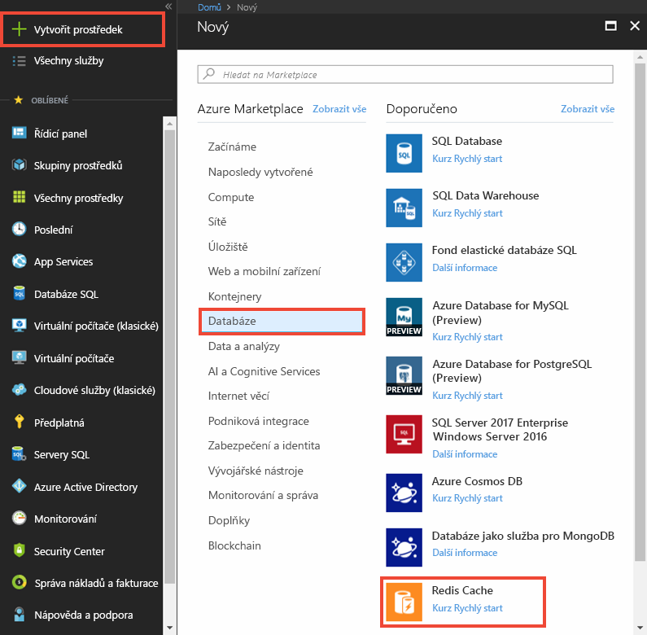

Pokud chcete vytvořit mezipaměť, přihlaste se nejdříve k [portálu Azure Portal](https://portal.azure.com), klikněte na **Nový**, **Data + úložiště** a potom na **Mezipaměť Redis**.

>[AZURE.NOTE] Pokud účet Azure nemáte, můžete si během několika minut [vytvořit bezplatný účet Azure](https://azure.microsoft.com/pricing/free-trial/?WT.mc_id=redis_cache_hero).

>[AZURE.NOTE] Mezipaměti můžete vytvářet na portálu Azure Portal, ale také pomocí šablon Resource Manageru, PowerShellu nebo rozhraní příkazového řádku Azure.
>
>-  Pokud chcete mezipaměť vytvořit pomocí šablony Resource Manageru, přečtěte si článek [Vytvoření mezipaměti Redis pomocí šablony](../articles/redis-cache/cache-redis-cache-arm-provision.md).
>-  Pokud chcete mezipaměti vytvořit pomocí Azure PowerShellu, přečtěte si článek [Správa mezipaměti Azure Redis Cache pomocí Azure PowerShellu](../articles/redis-cache/cache-howto-manage-redis-cache-powershell.md).
>-  Pokud chcete mezipaměť vytvořit pomocí příkazového řádku Azure (CLI), přečtěte si článek [Postup vytvoření a správy mezipaměti Azure Redis Cache pomocí rozhraní příkazového řádku Azure (CLI)](../articles/redis-cache/cache-manage-cli.md).

V okně **Nová mezipaměť Redis** zadejte požadovanou konfiguraci mezipaměti.

 

-   Do pole **Název DNS** zadejte název mezipaměti, kterou chcete použít pro koncový bod mezipaměti. Název mezipaměti musí být řetězec o délce 1 až 63 znaků a smí obsahovat jenom čísla, písmena a znak `-`. Název mezipaměti nesmí začínat ani končit znakem `-` a po sobě jdoucí znaky `-` nejsou platné.
-   V rozevíracím seznamu **Předplatné** vyberte požadované předplatné, se kterým chcete mezipaměť používat. Pokud má váš účet jenom jedno předplatné, vybere se automaticky a rozevírací seznam **Předplatné** se nezobrazí.
-   V části **Skupina prostředků** vyberte nebo vytvořte skupinu prostředků pro mezipaměť. Další informace najdete v článku [Použití skupin prostředků ke správě prostředků Azure](../articles/resource-group-overview.md). 
-   K určení zeměpisného umístění, ve kterém se mezipaměť hostuje, použijte **Umístění**. K zajištění nejlepšího výkonu Microsoft důrazně doporučuje vytvoření mezipaměti ve stejné oblasti, kde se už nachází klientská aplikace mezipaměti.
-   K výběru požadované velikosti a funkcí mezipaměti použijte možnost **Cenová úroveň**.
-   **Cluster Redis** vám umožní vytvoření mezipamětí, které jsou větší než 53 GB, a sdílení dat mezi různými uzly Redis. Další informace najdete v článku [Postup konfigurace clusterů pro mezipaměť Azure Redis Cache Premium](../articles/redis-cache/cache-how-to-premium-clustering.md).
-   **Trvalost dat Redis** vám umožňuje zachovat mezipaměť pro účet služby Azure Storage. Pokyny týkající se konfigurace trvalosti najdete v článku [Postup konfigurace trvalosti pro mezipaměť Azure Redis Cache Premium](../articles/redis-cache/cache-how-to-premium-persistence.md).
-   Služba **Virtual Network** nabízí lepší zabezpečení a izolaci omezením přístupu k vaší mezipaměti jenom pro ty klienty, kteří se nacházejí v určené službě Azure Virtual Network. K dalšímu omezení přístupu k Redisu můžete použít všechny funkce sítě VNet, například podsítě, zásady řízení přístupu a další funkce. Další informace najdete v článku [Postup konfigurace podpory služby Virtual Network pro mezipaměť Azure Redis Cache Premium](../articles/redis-cache/cache-how-to-premium-vnet.md).

Po nakonfigurování možností nové mezipaměti klikněte na **Vytvořit**. Vytvoření mezipaměti může několik minut trvat. Pokud chcete zkontrolovat stav, můžete průběh sledovat na úvodním panelu. Po vytvoření má nová mezipaměť stav **Spuštěno** a je připravená k použití s [výchozím nastavením](../articles/redis-cache/cache-configure.md#default-redis-server-configuration).

<!---HONumber=Aug16_HO4-->

