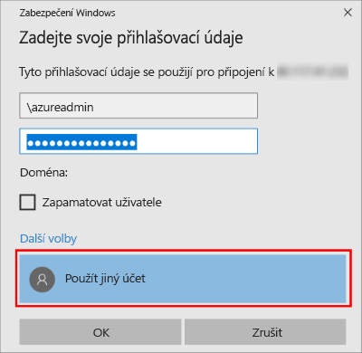

Podle následujícího postupu se připojte k virtuálnímu počítači s SQL Serverem pomocí Vzdálené plochy:

1. Po vytvoření a spuštění virtuálního počítače Azure klikněte na webu Azure Portal na ikonu služby Virtual Machines a zobrazte vaše virtuální počítače.

1. Klikněte na tři tečky (**...**) u vašeho nového virtuálního počítače.

1. Klikněte na **Připojit**.

   

1. Otevřete soubor **RDP**, který prohlížeč stáhne pro virtuální počítač.

1. Připojení ke vzdálené ploše vás upozorní, že nelze identifikovat vydavatele tohoto vzdáleného připojení. Pokračujte kliknutím na **Připojit**.

1. V dialogovém okně **Zabezpečení systému Windows** klikněte na **Použít jiný účet**. Možná budete muset kliknout na **Další možnosti**, aby se tato možnost zobrazila. Zadejte uživatelské jméno a heslo, které jste nakonfigurovali při vytváření virtuálního počítače. Před uživatelské jméno je nutné přidat zpětné lomítko.

   

Po připojení k virtuálnímu počítači s SQL Serverem můžete spustit SQL Server Management Studio a připojit se pomocí ověřování systému Windows se svými přihlašovacími údaji místního správce. Pokud jste povolili ověřování SQL Serveru, můžete se také připojit pomocí ověřování SQL Serveru a použít k tomu přihlašovací jméno a heslo SQL Serveru, které jste nakonfigurovali během zřizování.

Přístup k počítači vám umožňuje podle potřeb přímo měnit nastavení počítače a SQL Serveru. Můžete například nakonfigurovat nastavení brány firewall nebo změnit nastavení konfigurace SQL Serveru.